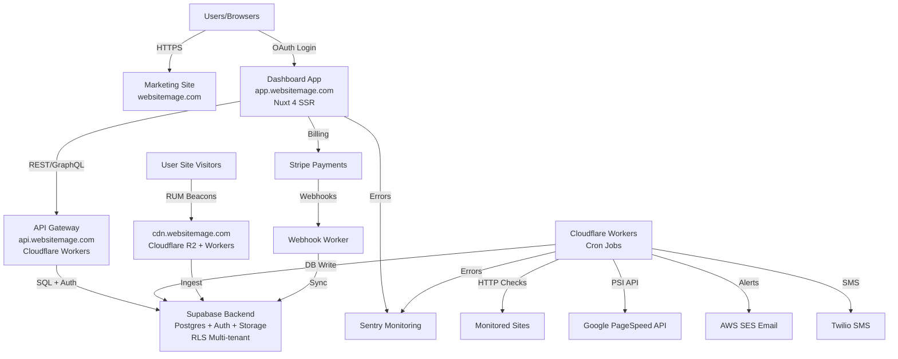
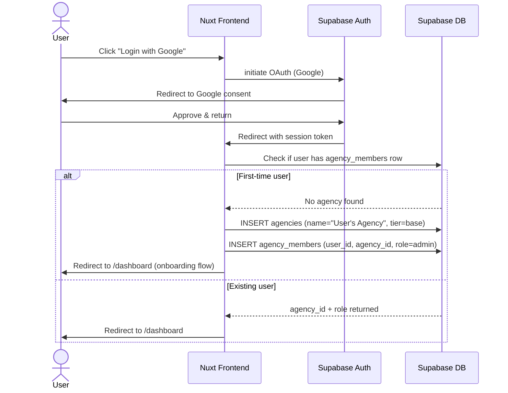
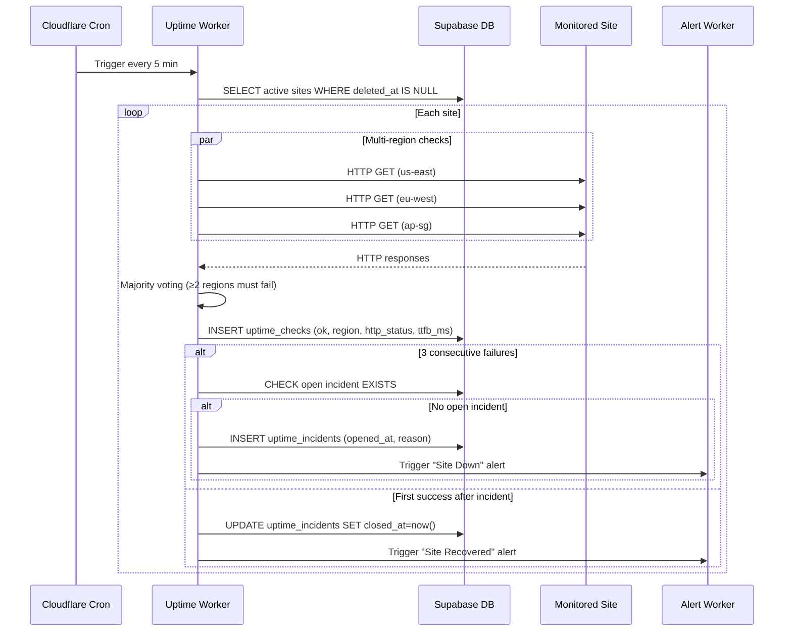
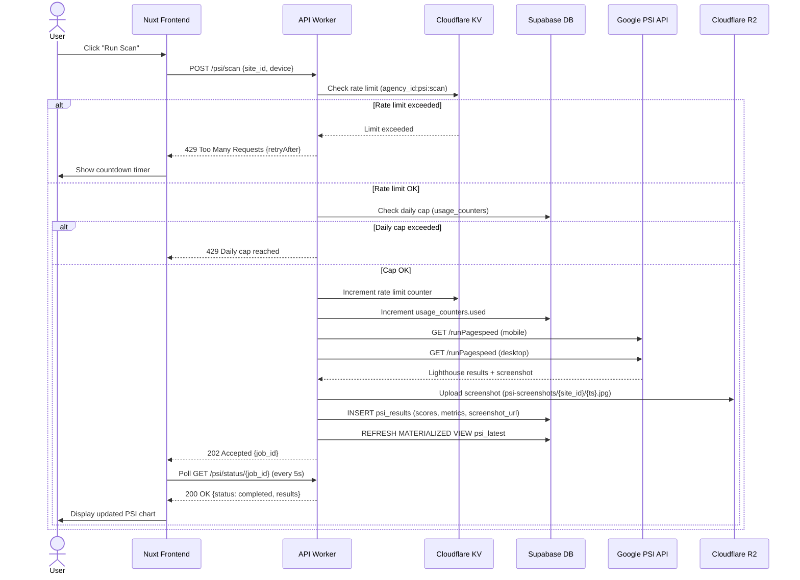
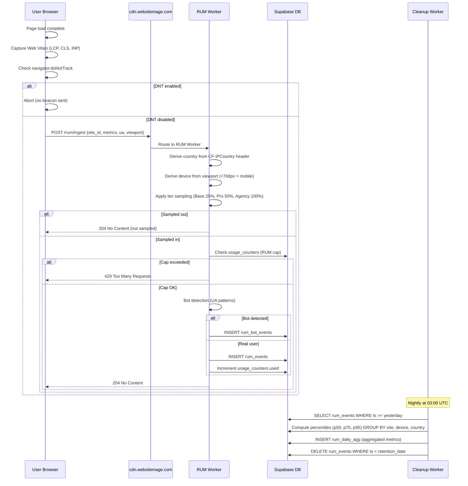
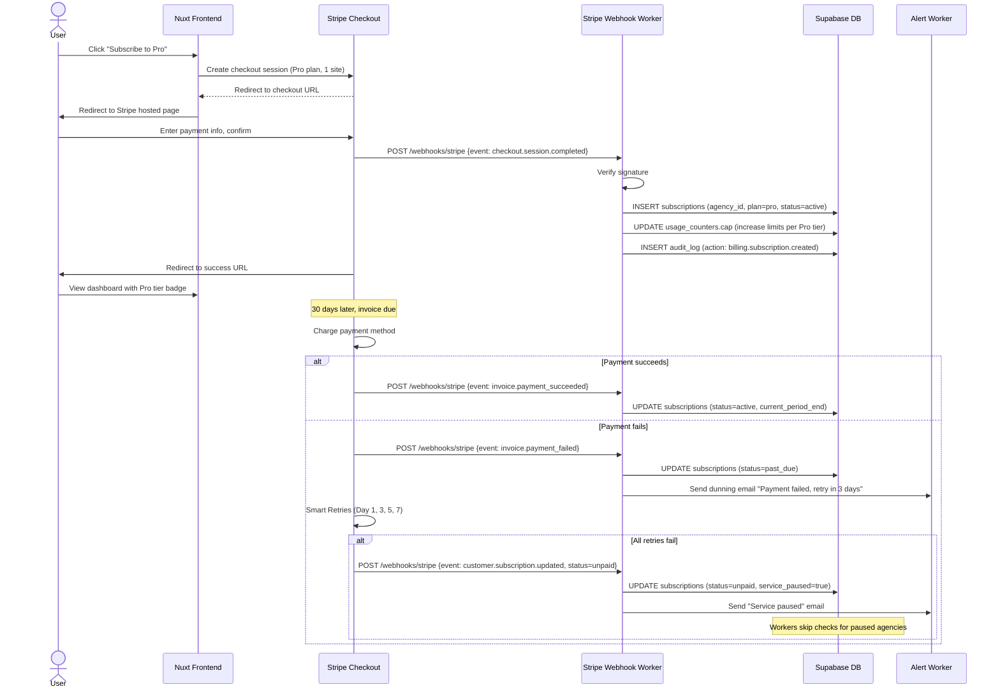

# Website Mage Architecture Document

<!-- Powered by BMAD™ Core -->

**Version:** 1.0  
**Date:** 2025-10-26  
**Author:** Kyle Baker  
**Project:** Website Mage SaaS Platform

---

## Introduction

This document outlines the overall project architecture for Website Mage, including backend systems, shared services, and both UI and non-UI concerns. Its primary goal is to serve as the guiding architectural blueprint for AI-driven development, ensuring consistency and adherence to chosen patterns and technologies.

**Relationship to Frontend Architecture:**  
This document covers the complete full-stack architecture including the Nuxt 4 frontend. Core technology stack choices documented herein are definitive for the entire project.

### Starter Template or Existing Project

**N/A** - This is a greenfield project built from scratch. No starter template will be used. The architecture leverages:

- Nuxt 4 (initialized fresh)
- Cloudflare Workers (Wrangler CLI)
- Supabase (managed platform)
- Monorepo structure with Turborepo + PNPM workspaces

### Change Log

| Date       | Version | Description                                                        | Author     |
| ---------- | ------- | ------------------------------------------------------------------ | ---------- |
| 2025-10-26 | 1.0     | Initial Architecture document creation from comprehensive planning | Kyle Baker |

---

## High Level Architecture

### Technical Summary

Website Mage employs a **serverless-first, edge-optimized architecture** built on three pillars: Nuxt 4 SSR for the frontend dashboard, Cloudflare Workers for API/cron layer, and Supabase for data/auth backend. This design prioritizes low operational overhead, automatic global scaling, and pay-per-use cost efficiency. Multi-tenant Row-Level Security (RLS) isolates agency data at the database layer while Workers enforce rate limits and quota caps per tier. The system supports three subscription tiers (Base, Pro, Agency) with differentiated monitoring frequencies, sampling rates, and caps—all enforced at the edge and database layers. This architecture directly supports the PRD goals of maintaining infrastructure costs ≤$200/month while monitoring 1,000+ sites.

### High Level Overview

**Architectural Style:** Serverless hybrid with edge compute  
**Repository Structure:** Monorepo (PNPM workspaces + Turborepo)  
**Service Architecture:** Distributed serverless functions + SSR frontend + managed Postgres backend

**Primary Flow:**

1. **User → Nuxt SSR Dashboard** (app.websitemage.com)
2. **Dashboard → Cloudflare Workers API** (api.websitemage.com) for data operations
3. **Workers → Supabase Postgres** with RLS enforcement
4. **Workers (cron) → External APIs** (PageSpeed Insights, Twilio, SES) for monitoring/alerting
5. **Browser → RUM CDN** (cdn.websitemage.com) → Worker ingestion → Supabase

**Key Architectural Decisions:**

- **Serverless:** Eliminates server management, scales automatically, cost-efficient at <500 customers
- **Edge-first:** Cloudflare global network reduces latency for uptime checks and RUM ingestion
- **Managed Postgres:** Supabase provides RLS, Auth, Storage without custom implementation
- **Separation of concerns:** Frontend (Nuxt), API/cron (Workers), Data (Supabase), CDN (R2)

### High Level Project Diagram



### Architectural and Design Patterns

- **Multi-Tenancy with RLS:** All database tables scoped by `agency_id` with Postgres Row-Level Security policies enforcing isolation. Ensures agencies cannot access other agencies' data via direct SQL or compromised API.  
  _Rationale:_ Security-first data isolation without application-layer filtering complexity.

- **Edge-First Compute:** Cloudflare Workers deployed globally handle uptime checks, RUM ingestion, and rate limiting close to users/sites.  
  _Rationale:_ Reduces latency for uptime checks (multi-region) and RUM beacon ingestion from worldwide visitors.

- **Separation of Concerns - API Gateway Pattern:** Cloudflare Workers act as API gateway between frontend and Supabase, handling rate limiting, authentication proxy, and tier-based logic.  
  _Rationale:_ Keeps frontend lightweight, centralizes security checks, enables independent scaling.

- **Event-Driven Cron Jobs:** Scheduled Workers trigger at intervals (5 min uptime, hourly PSI, nightly cleanup) without long-running servers.  
  _Rationale:_ Serverless cron eliminates server provisioning, auto-scales with site count.

- **Repository Pattern (via Supabase SDK):** All data access via Supabase client SDK with RLS enforcement, no direct SQL in Workers/frontend.  
  _Rationale:_ Leverages Supabase's built-in security model, simplifies queries.

- **Optimistic UI + Polling:** Frontend initiates long-running operations (PSI scans), polls for completion rather than WebSockets.  
  _Rationale:_ Simpler implementation for MVP, works across all browsers, no persistent connections.

- **Soft Delete + Retention Policies:** Sites marked `deleted_at` instead of hard delete; automated cleanup Workers purge old data per tier retention.  
  _Rationale:_ Allows recovery window, maintains referential integrity, controls storage costs.

---

## Tech Stack

Website Mage uses modern, serverless-first technologies optimized for low operational overhead and automatic scaling. All versions are pinned to ensure reproducible builds.

### Cloud Infrastructure

- **Provider:** Cloudflare (Workers, R2, KV) + Supabase (managed Postgres/Auth/Storage) + Netlify (frontend hosting)
- **Key Services:** Cloudflare Workers for edge compute, Cloudflare R2 for CDN assets, Supabase Postgres for data, AWS SES for email, Twilio for SMS
- **Deployment Regions:** Cloudflare global network (200+ cities), Supabase US-East-1 (with future expansion)

### Technology Stack Table

| Category               | Technology         | Version        | Purpose                      | Rationale                                            |
| ---------------------- | ------------------ | -------------- | ---------------------------- | ---------------------------------------------------- |
| **Language**           | TypeScript         | 5.3.3          | Primary development language | Strong typing, excellent tooling, team expertise     |
| **Runtime**            | Node.js            | 20.11.0 (LTS)  | JavaScript runtime           | LTS version, stable performance, wide ecosystem      |
| **Package Manager**    | PNPM               | 8.15.0         | Dependency management        | Disk efficiency, strict resolution, monorepo support |
| **Monorepo**           | Turborepo          | 1.12.0         | Build orchestration          | Intelligent caching, parallel execution              |
| **Frontend Framework** | Nuxt               | 4.0.0          | SSR dashboard application    | Vue 3 SSR, excellent DX, hybrid rendering            |
| **UI Framework**       | TailwindCSS        | 3.4.1          | Utility-first styling        | Rapid development, small bundle, design system       |
| **State Management**   | Pinia              | 2.1.7          | Nuxt store                   | Official Vue state management, TypeScript native     |
| **Charts**             | Chart.js           | 4.4.1          | Dashboard visualizations     | Lightweight, responsive, canvas-based                |
| **Backend Platform**   | Supabase           | Latest         | Postgres + Auth + Storage    | Managed RLS, auto APIs, excellent DX                 |
| **Database**           | PostgreSQL         | 15             | Relational database          | Supabase managed, JSON support, mature               |
| **Auth**               | Supabase Auth      | Latest         | OAuth + JWT                  | Google/MS/GitHub OAuth, secure sessions              |
| **Edge Compute**       | Cloudflare Workers | Latest         | API gateway + cron           | Global edge, sub-50ms startup, KV storage            |
| **CDN/Storage**        | Cloudflare R2      | Latest         | RUM JS + assets              | S3-compatible, free egress, edge caching             |
| **Payments**           | Stripe             | API 2023-10-16 | Subscription billing         | Industry standard, metered usage support             |
| **Email**              | AWS SES            | Latest         | Transactional email          | Cost-effective, reliable, SES SMTP                   |
| **SMS**                | Twilio             | Latest         | SMS alerts                   | US/Canada support, delivery tracking                 |
| **Error Tracking**     | Sentry             | ^7.100.0       | Frontend + Worker errors     | Real-time alerts, source maps, PII scrubbing         |
| **Testing (Unit)**     | Vitest             | ^1.2.0         | Unit + integration tests     | Fast, Vite-powered, Jest-compatible                  |
| **Testing (E2E)**      | Playwright         | ^1.41.0        | End-to-end testing           | Cross-browser, reliable, parallel execution          |
| **Testing (Load)**     | k6                 | ^0.49.0        | Load testing                 | Scriptable, RUM ingest + Worker stress tests         |
| **Linting**            | ESLint             | ^8.56.0        | Code quality                 | TypeScript support, Vue plugin                       |
| **Formatting**         | Prettier           | ^3.2.0         | Code formatting              | Consistent style, auto-fix                           |
| **Git Hooks**          | Husky              | ^9.0.0         | Pre-commit hooks             | Lint + format enforcement                            |
| **Commit Convention**  | commitlint         | ^18.6.0        | Conventional commits         | Standardized commit messages, changelog generation   |
| **IaC**                | Wrangler CLI       | ^3.23.0        | Cloudflare Workers deploy    | Infrastructure as code for Workers                   |
| **CI/CD**              | GitHub Actions     | N/A            | Automation pipeline          | Native GitHub integration, matrix builds             |

---

## Data Models

### Core Entities Overview

Website Mage uses a multi-tenant data model with `agency_id` as the primary scoping key. All entities relate back to the `agencies` table.

**Hierarchy:**

```
agencies (1)
  ↓
agency_members (n) ← users (Supabase Auth)
  ↓
sites (n)
  ↓
├─ uptime_checks (n) → uptime_incidents (n)
├─ psi_results (n)
├─ rum_events (n) → rum_daily_agg (rollups)
├─ alerts_sent (n)
└─ client_site_access (n) [for Client role users]
```

### agencies

**Purpose:** Root entity representing each customer organization (agency, freelancer, or individual)

**Key Attributes:**

- `id`: uuid (primary key, auto-generated)
- `name`: text (agency display name)
- `tier`: enum `agency_tier` (base | pro | agency) - determines feature access and limits
- `branding_json`: jsonb (logo URL, primary color, custom domain, footer text for white-label)
- `custom_domain`: text (nullable, e.g., `monitoring.myagency.com`)
- `created_at`: timestamptz (account creation)
- `updated_at`: timestamptz (last modification)

**Relationships:**

- One-to-many with `agency_members` (team members)
- One-to-many with `sites` (monitored sites)

**Design Decision:** `tier` drives all feature gating and quota enforcement; `branding_json` allows flexible white-label customization without schema changes.

### users (Supabase Auth native)

**Purpose:** Authentication and user profile, managed by Supabase Auth

**Key Attributes:**

- `id`: uuid (Supabase Auth managed)
- `email`: text (unique, verified)
- `provider`: OAuth provider (google, microsoft, github)
- `metadata`: jsonb (name, avatar_url from OAuth)

**Relationships:**

- Many-to-many with `agencies` via `agency_members`

### agency_members

**Purpose:** Junction table linking users to agencies with roles

**Key Attributes:**

- `agency_id`: uuid (FK to agencies)
- `user_id`: uuid (FK to auth.users)
- `role`: enum `member_role` (admin | staff | client)
- `created_at`: timestamptz

**Relationships:**

- Many-to-one with `agencies`
- Many-to-one with `users`

**Design Decision:** Composite primary key `(agency_id, user_id)` enforces one role per user per agency; future: support multiple roles or agencies per user.

### sites

**Purpose:** Each website being monitored

**Key Attributes:**

- `id`: uuid (primary key)
- `agency_id`: uuid (FK to agencies, RLS scope)
- `domain`: text (full URL, e.g., `https://example.com`)
- `expected_keyword`: text (nullable, for uptime content validation)
- `settings_json`: jsonb (check frequency override, alert recipients, SSL expiry, quiet hours)
- `deleted_at`: timestamptz (nullable, soft delete)
- `created_at`: timestamptz
- `updated_at`: timestamptz

**Unique Constraint:** `(agency_id, domain)` - prevents duplicate sites within agency

**Relationships:**

- Many-to-one with `agencies`
- One-to-many with `uptime_checks`, `psi_results`, `rum_events`, `alerts_sent`
- Many-to-many with users (role=client) via `client_site_access`

**Design Decision:** `settings_json` stores variable site configs (alert contacts, quiet hours) without schema migrations; `deleted_at` enables soft delete with 30-day recovery window.

### uptime_checks

**Purpose:** Log every uptime check attempt (5-10 min intervals)

**Key Attributes:**

- `id`: bigserial (primary key, high-volume)
- `agency_id`: uuid (denormalized for RLS)
- `site_id`: uuid (FK to sites)
- `checked_at`: timestamptz (check execution time)
- `region`: text (us-east, eu-west, ap-sg)
- `http_status`: int (nullable, e.g., 200, 500)
- `ttfb_ms`: int (time to first byte)
- `ok`: boolean (true if 2xx + keyword match)
- `err`: text (nullable, error message if failed)
- `created_at`: timestamptz

**Indexes:**

- `(site_id, checked_at DESC)` - fast queries for site timeline
- `(agency_id, checked_at DESC)` - agency-level reporting

**Relationships:**

- Many-to-one with `sites`
- Logically grouped into `uptime_incidents` when failures occur

**Retention:** 24 months (configurable)

### uptime_incidents

**Purpose:** Track open/closed incident windows (3+ consecutive failures)

**Key Attributes:**

- `id`: bigserial (primary key)
- `agency_id`: uuid
- `site_id`: uuid (FK to sites)
- `opened_at`: timestamptz (first failure timestamp)
- `closed_at`: timestamptz (nullable, recovery timestamp)
- `reason`: text (aggregated: "HTTP 500", "Timeout", "Keyword mismatch")
- `alert_sent_count`: int (default 0, incremented on each alert)

**Relationships:**

- Many-to-one with `sites`
- One-to-many with `alerts_sent`

**Design Decision:** Separate incident entity enables alert throttling (max 3 per incident); `closed_at NULL` = open incident.

### psi_results

**Purpose:** Store PageSpeed Insights / Lighthouse scan results

**Key Attributes:**

- `id`: bigserial (primary key)
- `agency_id`: uuid
- `site_id`: uuid (FK to sites)
- `scanned_at`: timestamptz
- `device`: text (`mobile` | `desktop`)
- `lighthouse_version`: text (e.g., `11.3.0`)
- `performance_score`: int (0-100)
- `lcp_ms`: int (Largest Contentful Paint)
- `cls`: numeric(6,3) (Cumulative Layout Shift, e.g., 0.123)
- `inp_ms`: int (Interaction to Next Paint)
- `fid_ms`: int (First Input Delay, legacy)
- `fcp_ms`: int (First Contentful Paint)
- `opportunities`: jsonb (array of improvement suggestions)
- `screenshot_url`: text (nullable, Cloudflare R2 URL)

**Indexes:**

- `(site_id, scanned_at DESC)` - trend queries
- `(agency_id, scanned_at DESC)` - agency rollups

**Materialized View (`psi_latest`):**

- `DISTINCT ON (site_id, device)` - fast dashboard reads for latest scores
- Refreshed on insert via trigger

**Retention:** Base 30d, Pro 90d, Agency 180d

### rum_events

**Purpose:** Raw real user monitoring beacons (high volume, transient)

**Key Attributes:**

- `id`: bigserial (primary key)
- `agency_id`: uuid
- `site_id`: uuid (FK to sites)
- `ts`: timestamptz (beacon timestamp)
- `nav_type`: text (navigate, reload, back_forward, prerender)
- `device`: text (mobile | desktop, derived from viewport)
- `ua`: text (simplified User-Agent Client Hints, no PII)
- `viewport_w`: int, `viewport_h`: int
- `country`: char(2) (ISO code, from Cloudflare header)
- `lcp_ms`: int, `cls`: numeric(6,3), `inp_ms`: int, `fid_ms`: int, `ttfb_ms`: int, `fcp_ms`: int

**Indexes:**

- `(site_id, ts DESC)` - recent events
- `(country)` - region filtering

**Relationships:**

- Many-to-one with `sites`
- Aggregated nightly into `rum_daily_agg`

**Retention:** 6-12 months (purged after aggregation)

**Design Decision:** Narrow table (no PII, no IP) for GDPR compliance; high insert rate (1k+ req/s) handled by Supabase + KV buffer.

### rum_daily_agg

**Purpose:** Daily rollups of RUM metrics (p50/p75/p95) for fast querying

**Key Attributes:**

- `site_id`: uuid
- `day`: date
- `device`: text (mobile | desktop)
- `country`: char(2)
- `samples`: int (event count)
- `p50_lcp_ms`: int, `p75_lcp_ms`: int, `p95_lcp_ms`: int
- `p75_cls`: numeric(6,3), `p75_inp_ms`: int
- `p50_ttfb_ms`: int, `p50_fcp_ms`: int

**Primary Key:** `(site_id, day, device, country)`

**Retention:** 12-24 months (longer than raw events)

**Design Decision:** Precomputed percentiles enable <1s chart rendering for 90-day ranges.

### alerts_sent

**Purpose:** Log every email/SMS alert sent (for usage tracking + billing)

**Key Attributes:**

- `id`: bigserial (primary key)
- `agency_id`: uuid
- `site_id`: uuid (nullable if account-level alert)
- `incident_id`: bigint (nullable, FK to uptime_incidents)
- `channel`: enum `alert_channel` (email | sms)
- `recipient`: text (email address or E.164 phone)
- `sent_at`: timestamptz
- `meta`: jsonb (SES message ID, Twilio SID, delivery status, errors)

**Indexes:**

- `(agency_id, sent_at DESC)` - usage queries
- `(site_id, sent_at DESC)` - site-level history

**Relationships:**

- Many-to-one with `sites`, `uptime_incidents`

**Design Decision:** Separate log enables accurate usage/billing tracking; `meta` flexible for provider-specific data.

### usage_counters

**Purpose:** Track monthly quotas and consumption per agency/site/metric

**Key Attributes:**

- `id`: bigserial (primary key)
- `agency_id`: uuid
- `site_id`: uuid (nullable for pooled metrics like Agency RUM)
- `metric`: enum `usage_metric` (email | sms | rum)
- `month`: date (yyyy-mm-01, partition key)
- `cap`: int (plan-derived limit)
- `used`: int (incremented on consumption)
- `updated_at`: timestamptz

**Unique Constraint:** `(agency_id, COALESCE(site_id, '00000000-...'), metric, month)`

**Design Decision:** `cap` calculated from `agencies.tier`; triggers increment `used` on inserts to `alerts_sent` and `rum_events`; Worker checks `used >= cap` before allowing operations.

### client_site_access

**Purpose:** Grant client users (role=client) access to specific sites only

**Key Attributes:**

- `agency_id`: uuid (denormalized for RLS)
- `site_id`: uuid (FK to sites)
- `user_id`: uuid (FK to auth.users)
- `created_at`: timestamptz

**Primary Key:** `(site_id, user_id)`

**Relationships:**

- Many-to-one with `sites`, `users`

**Design Decision:** Enables granular per-site access control for client role; RLS policies use `EXISTS (SELECT 1 FROM client_site_access WHERE ...)` for authorization.

### audit_log

**Purpose:** Compliance and debugging trail for high-impact actions

**Key Attributes:**

- `id`: bigserial (primary key)
- `agency_id`: uuid
- `user_id`: uuid (nullable if system action)
- `site_id`: uuid (nullable)
- `action`: text (e.g., `site.create`, `billing.plan.changed`)
- `details`: jsonb (old/new values, relevant context)
- `created_at`: timestamptz

**Indexes:**

- `(agency_id, created_at DESC)` - agency audit log view
- `(site_id, created_at DESC)` - site-specific history

**Retention:** 12 months

**Design Decision:** `action` uses dot-notation namespace; `details` JSONB allows flexible logging without schema changes.

---

## Components

Website Mage is structured as a monorepo with three primary packages plus shared utilities.

### Nuxt Frontend (`packages/web`)

**Responsibility:** Server-Side Rendered dashboard application serving agency admins, staff, and client users

**Key Interfaces:**

- `GET /dashboard` - Main dashboard with site list and health cards
- `GET /sites/:id` - Site detail page with uptime/PSI/RUM tabs
- `GET /settings` - Account, team, billing, branding, audit log
- `GET /reports` - Monthly PDF report archive
- `GET /client-dashboard` - Simplified client view (Agency tier)

**Dependencies:**

- Supabase SDK (auth + RLS queries)
- Cloudflare Workers API (via fetch composable)
- Stripe.js (billing portal iframe)
- Sentry (error tracking)

**Technology Stack:**

- Nuxt 4.0 (Vue 3, SSR)
- TailwindCSS (utility-first styling)
- Pinia (state management for user session, site list, usage meters)
- Chart.js (uptime/PSI/RUM visualizations)
- VueUse (composable utilities)

**Structure:**

```
packages/web/
├── app/
│   ├── components/       # Reusable UI components (Button, Card, Chart, Modal)
│   ├── composables/      # useSupabase, useAPI, useAuth, useCharts
│   ├── layouts/          # default.vue (header+nav), client.vue (white-label)
│   ├── pages/
│   │   ├── dashboard.vue
│   │   ├── sites/
│   │   │   ├── index.vue
│   │   │   └── [id].vue
│   │   ├── settings/
│   │   │   ├── index.vue
│   │   │   ├── team.vue
│   │   │   ├── billing.vue
│   │   │   ├── branding.vue
│   │   │   └── audit-log.vue
│   │   ├── reports.vue
│   │   └── client-dashboard.vue
│   ├── plugins/          # sentry.client.ts, supabase.ts, stripe.ts
│   ├── stores/           # user.ts, sites.ts, usage.ts
│   └── middleware/       # auth.ts (redirect if not logged in)
├── public/               # Static assets (favicon, images)
└── nuxt.config.ts        # Nuxt configuration
```

### Cloudflare Workers (`packages/workers`)

**Responsibility:** Edge-deployed serverless functions for API gateway, cron jobs, and event handlers

#### Worker: API Gateway (`workers/api`)

**Responsibility:** REST API proxy between Nuxt frontend and Supabase with rate limiting

**Key Interfaces:**

- `GET /health` - Health check
- `POST /psi/scan` - Trigger manual PSI scan (rate limited)
- `GET /psi/status/:job_id` - Poll scan status
- `GET /api/export` - CSV export (uptime/PSI/RUM)
- All requests proxied to Supabase with rate limit enforcement

**Dependencies:** Supabase service key, KV namespace (`RATE_LIMIT_KV`)

**Technology Stack:** Cloudflare Workers, TypeScript, Hono (lightweight router)

#### Worker: Uptime Cron (`workers/uptime`)

**Responsibility:** Scheduled HTTP checks every 5-10 minutes based on tier

**Key Interfaces:**

- Triggered by Cloudflare Cron: `*/5 * * * *` (every 5 min)
- Queries active sites from Supabase
- Executes multi-region checks (us-east, eu-west, ap-sg)
- Inserts `uptime_checks` records
- Opens/closes `uptime_incidents` based on majority voting
- Triggers alert Worker on incident state change

**Dependencies:** Supabase service key, Sentry DSN

**Technology Stack:** Cloudflare Workers, fetch API for HTTP checks

#### Worker: PSI Queue (`workers/psi`)

**Responsibility:** Hourly batch processing of PageSpeed Insights scans

**Key Interfaces:**

- Triggered by Cloudflare Cron: `0 * * * *` (hourly)
- Queries sites eligible for scheduled scan (Base monthly, Pro/Agency weekly)
- Calls Google PageSpeed Insights API (mobile + desktop)
- Inserts `psi_results` records
- Uploads screenshots to R2

**Dependencies:** Google PSI API key, Supabase, Cloudflare R2 binding

**Technology Stack:** Cloudflare Workers, Google PSI API

#### Worker: RUM Ingest (`workers/rum`)

**Responsibility:** On-demand beacon ingestion from RUM JavaScript

**Key Interfaces:**

- `POST /rum/ingest` - Accepts JSON beacon
- Validates payload, derives country from Cloudflare header
- Applies tier-based sampling (Base 25%, Pro 50%, Agency 100%)
- Checks monthly event caps from `usage_counters`
- Inserts `rum_events` or returns 429 if capped
- Filters bot traffic to `rum_bot_events`

**Dependencies:** Supabase, KV (`RUM_KV` for burst buffering)

**Technology Stack:** Cloudflare Workers, bot detection patterns

#### Worker: Cleanup & Aggregation (`workers/cleanup`)

**Responsibility:** Nightly maintenance jobs

**Key Interfaces:**

- Triggered by Cloudflare Cron: `0 3 * * *` (daily 03:00 UTC)
- Computes `rum_daily_agg` rollups from previous day's `rum_events`
- Purges old data per retention policy (uptime 24mo, PSI tier-based, RUM 6-12mo, alerts 6mo, audit 12mo)
- Archives PSI screenshots to S3 (optional)

**Dependencies:** Supabase, optional S3 for backups

**Technology Stack:** Cloudflare Workers, PostgreSQL percentile functions

#### Worker: Stripe Webhook (`workers/stripe-webhook`)

**Responsibility:** Handle Stripe billing events

**Key Interfaces:**

- `POST /webhooks/stripe` - Receives Stripe webhooks
- Verifies signature
- Processes: `checkout.session.completed`, `customer.subscription.updated`, `invoice.payment_succeeded/failed`
- Syncs `subscriptions` table
- Triggers dunning emails on payment failure
- Pauses/resumes services based on subscription status

**Dependencies:** Stripe webhook secret, Supabase, SES (for dunning emails)

**Technology Stack:** Cloudflare Workers, Stripe SDK

#### Worker: Monthly Usage Reporter (`workers/usage-reporter`)

**Responsibility:** Report metered usage to Stripe

**Key Interfaces:**

- Triggered by Cloudflare Cron: `0 0 1 * *` (1st of month, 00:00 UTC)
- Queries `usage_counters` for previous month
- Calculates email overages and SMS totals
- Calls Stripe API: `POST /v1/subscription_items/{item_id}/usage_records`
- Resets `usage_counters` for new month

**Dependencies:** Stripe API key, Supabase

**Technology Stack:** Cloudflare Workers, Stripe SDK

### RUM JavaScript (`packages/rum-js`)

**Responsibility:** Client-side script embedded on monitored sites to collect real user metrics

**Key Interfaces:**

- Exports single function: `init()` - auto-invoked on script load
- Reads `data-site` attribute from script tag for site ID
- Captures Web Vitals (LCP, CLS, INP, TTFB, FCP) using `web-vitals` library patterns
- Sends beacon via `POST /rum/ingest` to cdn.websitemage.com
- Honors Do Not Track (`navigator.doNotTrack === "1"`)

**Dependencies:** None (vanilla JS, inline Web Vitals implementation)

**Technology Stack:** TypeScript (compiled to vanilla JS), esbuild

**Bundle Output:**

- `dist/rum.js` (development, source maps)
- `dist/rum.min.js` (production, <5KB gzipped)

**Deployment:** Uploaded to Cloudflare R2 `cdn-websitemage` bucket with 1-year Cache-Control

### Shared Utilities (`packages/shared`)

**Responsibility:** Shared TypeScript types, constants, and utilities used across frontend and Workers

**Key Exports:**

- `types/` - Database schema types (generated from Supabase), API request/response types
- `constants/` - Agency tiers, metric names, rate limits, caps per tier
- `utils/` - Date formatting, validation helpers, bot UA patterns
- `schemas/` - Zod schemas for API validation

**Dependencies:** Zod (schema validation)

**Technology Stack:** TypeScript, Zod

---

## External APIs

### Google PageSpeed Insights API

- **Purpose:** Perform Lighthouse audits for mobile and desktop performance scores and Core Web Vitals
- **Documentation:** https://developers.google.com/speed/docs/insights/v5/get-started
- **Base URL:** `https://www.googleapis.com/pagespeedonline/v5/runPagespeed`
- **Authentication:** API key (query parameter `key=`)
- **Rate Limits:** 25,000 queries/day (free tier), 400 queries/100 seconds

**Key Endpoints Used:**

- `GET /runPagespeed?url={url}&strategy={mobile|desktop}&category=performance&key={API_KEY}`

**Integration Notes:**

- Hourly Worker batches up to 50 scans to stay within rate limits
- Exponential backoff on 429 responses
- Cache results for debounce intervals (Base 10min, Pro 5min, Agency 3min)
- Extract: `lighthouseResult.categories.performance.score`, `lighthouseResult.audits[*]`, `lighthouseResult.audits['final-screenshot']`

### AWS Simple Email Service (SES)

- **Purpose:** Send transactional emails (alerts, trial reminders, dunning, reports)
- **Documentation:** https://docs.aws.amazon.com/ses/
- **Base URL:** SMTP endpoint `email-smtp.us-east-1.amazonaws.com:587`
- **Authentication:** SMTP credentials (username + password)
- **Rate Limits:** Sandbox 200/day, Production 50/second (adjustable)

**Key Endpoints Used:**

- SMTP protocol for email delivery (no REST calls)

**Integration Notes:**

- Verified domain: `alerts@websitemage.com`
- Templates stored in Worker code (no SES Templates used at MVP)
- Track message IDs in `alerts_sent.meta.ses_message_id`
- Bounce handling via SNS (future phase)

### Twilio SMS API

- **Purpose:** Send SMS alerts for critical incidents
- **Documentation:** https://www.twilio.com/docs/sms
- **Base URL:** `https://api.twilio.com/2010-04-01/Accounts/{AccountSid}/Messages.json`
- **Authentication:** Basic Auth (Account SID + Auth Token)
- **Rate Limits:** Default 500 SMS/second (adjustable)

**Key Endpoints Used:**

- `POST /Accounts/{AccountSid}/Messages.json` - Send SMS

**Integration Notes:**

- US/Canada only at MVP launch (international in Phase 2)
- Delivery status via status callback webhook (optional)
- Cost: $0.0075/SMS, charged to customer at $0.016/SMS (2× markup)
- Track SID in `alerts_sent.meta.twilio_sid`

### Stripe API

- **Purpose:** Subscription management, metered billing, webhooks
- **Documentation:** https://stripe.com/docs/api
- **Base URL:** `https://api.stripe.com/v1/`
- **Authentication:** Bearer token (secret key)
- **Rate Limits:** 100 reads/second, 100 writes/second per API key

**Key Endpoints Used:**

- `POST /v1/checkout/sessions` - Create checkout session
- `POST /v1/billing_portal/sessions` - Generate customer portal URL
- `POST /v1/subscription_items/{item_id}/usage_records` - Report metered usage
- `POST /v1/webhook_endpoints` - (setup only) Register webhook endpoint
- Webhooks received: `checkout.session.completed`, `customer.subscription.*`, `invoice.payment_*`

**Integration Notes:**

- API version pinned: `2023-10-16`
- Idempotency keys used for all POST requests
- Webhook signature verification mandatory
- Test mode vs Live mode environments mirrored

---

## Core Workflows

### Workflow: User Login & Agency Creation



### Workflow: Uptime Check with Incident Detection



### Workflow: Manual PageSpeed Scan with Rate Limiting



### Workflow: RUM Beacon Collection & Aggregation



### Workflow: Stripe Subscription & Dunning



---

## Database Schema

### SQL DDL (Core Tables)

```sql
-- Enums
CREATE TYPE agency_tier AS ENUM ('base', 'pro', 'agency', 'enterprise_future');
CREATE TYPE member_role AS ENUM ('admin', 'staff', 'client');
CREATE TYPE alert_channel AS ENUM ('email', 'sms');
CREATE TYPE usage_metric AS ENUM ('email', 'sms', 'rum');

-- agencies
CREATE TABLE public.agencies (
  id UUID PRIMARY KEY DEFAULT gen_random_uuid(),
  name TEXT NOT NULL,
  tier agency_tier NOT NULL DEFAULT 'base',
  branding_json JSONB NOT NULL DEFAULT '{}',
  custom_domain TEXT,
  created_at TIMESTAMPTZ NOT NULL DEFAULT now(),
  updated_at TIMESTAMPTZ NOT NULL DEFAULT now()
);
CREATE INDEX idx_agencies_tier ON agencies(tier);

-- agency_members
CREATE TABLE public.agency_members (
  agency_id UUID NOT NULL REFERENCES agencies(id) ON DELETE CASCADE,
  user_id UUID NOT NULL REFERENCES auth.users(id) ON DELETE CASCADE,
  role member_role NOT NULL,
  created_at TIMESTAMPTZ NOT NULL DEFAULT now(),
  PRIMARY KEY (agency_id, user_id)
);
CREATE INDEX idx_agency_members_user ON agency_members(user_id);

-- sites
CREATE TABLE public.sites (
  id UUID PRIMARY KEY DEFAULT gen_random_uuid(),
  agency_id UUID NOT NULL REFERENCES agencies(id) ON DELETE CASCADE,
  domain TEXT NOT NULL,
  expected_keyword TEXT,
  settings_json JSONB NOT NULL DEFAULT '{}',
  deleted_at TIMESTAMPTZ,
  created_at TIMESTAMPTZ NOT NULL DEFAULT now(),
  updated_at TIMESTAMPTZ NOT NULL DEFAULT now(),
  UNIQUE(agency_id, domain)
);
CREATE INDEX idx_sites_agency ON sites(agency_id);
CREATE INDEX idx_sites_deleted ON sites(deleted_at) WHERE deleted_at IS NULL;

-- client_site_access
CREATE TABLE public.client_site_access (
  agency_id UUID NOT NULL,
  site_id UUID NOT NULL REFERENCES sites(id) ON DELETE CASCADE,
  user_id UUID NOT NULL REFERENCES auth.users(id) ON DELETE CASCADE,
  created_at TIMESTAMPTZ NOT NULL DEFAULT now(),
  PRIMARY KEY (site_id, user_id)
);
CREATE INDEX idx_csa_user ON client_site_access(user_id);

-- uptime_checks
CREATE TABLE public.uptime_checks (
  id BIGSERIAL PRIMARY KEY,
  agency_id UUID NOT NULL,
  site_id UUID NOT NULL REFERENCES sites(id) ON DELETE CASCADE,
  checked_at TIMESTAMPTZ NOT NULL DEFAULT now(),
  region TEXT NOT NULL,
  http_status INT,
  ttfb_ms INT,
  ok BOOLEAN NOT NULL,
  err TEXT,
  created_at TIMESTAMPTZ NOT NULL DEFAULT now()
);
CREATE INDEX idx_uptime_site_time ON uptime_checks(site_id, checked_at DESC);
CREATE INDEX idx_uptime_agency_time ON uptime_checks(agency_id, checked_at DESC);

-- uptime_incidents
CREATE TABLE public.uptime_incidents (
  id BIGSERIAL PRIMARY KEY,
  agency_id UUID NOT NULL,
  site_id UUID NOT NULL REFERENCES sites(id) ON DELETE CASCADE,
  opened_at TIMESTAMPTZ NOT NULL,
  closed_at TIMESTAMPTZ,
  reason TEXT,
  alert_sent_count INT NOT NULL DEFAULT 0
);
CREATE INDEX idx_incidents_site_opened ON uptime_incidents(site_id, opened_at DESC);

-- psi_results
CREATE TABLE public.psi_results (
  id BIGSERIAL PRIMARY KEY,
  agency_id UUID NOT NULL,
  site_id UUID NOT NULL REFERENCES sites(id) ON DELETE CASCADE,
  scanned_at TIMESTAMPTZ NOT NULL DEFAULT now(),
  device TEXT NOT NULL CHECK (device IN ('mobile', 'desktop')),
  lighthouse_version TEXT,
  performance_score INT,
  lcp_ms INT,
  cls NUMERIC(6,3),
  inp_ms INT,
  fid_ms INT,
  fcp_ms INT,
  opportunities JSONB,
  screenshot_url TEXT
);
CREATE INDEX idx_psi_site_time ON psi_results(site_id, scanned_at DESC);
CREATE INDEX idx_psi_agency_time ON psi_results(agency_id, scanned_at DESC);

-- psi_latest (materialized view)
CREATE MATERIALIZED VIEW public.psi_latest AS
  SELECT DISTINCT ON (site_id, device)
    site_id, device, scanned_at, performance_score,
    lcp_ms, cls, inp_ms, fid_ms, fcp_ms, lighthouse_version
  FROM psi_results
  ORDER BY site_id, device, scanned_at DESC;

-- Trigger to refresh psi_latest on insert
CREATE OR REPLACE FUNCTION refresh_psi_latest()
RETURNS TRIGGER LANGUAGE plpgsql AS $$
BEGIN
  REFRESH MATERIALIZED VIEW CONCURRENTLY public.psi_latest;
  RETURN NULL;
END;
$$;
CREATE TRIGGER trg_refresh_psi_latest
AFTER INSERT ON psi_results
FOR EACH STATEMENT EXECUTE FUNCTION refresh_psi_latest();

-- rum_events
CREATE TABLE public.rum_events (
  id BIGSERIAL PRIMARY KEY,
  agency_id UUID NOT NULL,
  site_id UUID NOT NULL REFERENCES sites(id) ON DELETE CASCADE,
  ts TIMESTAMPTZ NOT NULL DEFAULT now(),
  nav_type TEXT,
  device TEXT,
  ua TEXT,
  viewport_w INT,
  viewport_h INT,
  country CHAR(2),
  lcp_ms INT,
  cls NUMERIC(6,3),
  inp_ms INT,
  fid_ms INT,
  ttfb_ms INT,
  fcp_ms INT
);
CREATE INDEX idx_rum_site_ts ON rum_events(site_id, ts DESC);
CREATE INDEX idx_rum_country ON rum_events(country);

-- rum_daily_agg
CREATE TABLE public.rum_daily_agg (
  agency_id UUID NOT NULL,
  site_id UUID NOT NULL,
  day DATE NOT NULL,
  device TEXT NOT NULL,
  country CHAR(2),
  samples INT NOT NULL,
  p50_lcp_ms INT,
  p75_lcp_ms INT,
  p95_lcp_ms INT,
  p75_cls NUMERIC(6,3),
  p75_inp_ms INT,
  p50_ttfb_ms INT,
  p50_fcp_ms INT,
  PRIMARY KEY (site_id, day, device, country)
);
CREATE INDEX idx_rum_agg_site_day ON rum_daily_agg(site_id, day DESC);

-- rum_bot_events
CREATE TABLE public.rum_bot_events (
  id BIGSERIAL PRIMARY KEY,
  agency_id UUID NOT NULL,
  site_id UUID NOT NULL REFERENCES sites(id) ON DELETE CASCADE,
  ts TIMESTAMPTZ NOT NULL DEFAULT now(),
  ua TEXT,
  country CHAR(2),
  reason TEXT
);
CREATE INDEX idx_rum_bot_site_ts ON rum_bot_events(site_id, ts DESC);

-- alerts_sent
CREATE TABLE public.alerts_sent (
  id BIGSERIAL PRIMARY KEY,
  agency_id UUID NOT NULL,
  site_id UUID REFERENCES sites(id) ON DELETE SET NULL,
  incident_id BIGINT REFERENCES uptime_incidents(id) ON DELETE SET NULL,
  channel alert_channel NOT NULL,
  recipient TEXT NOT NULL,
  sent_at TIMESTAMPTZ NOT NULL DEFAULT now(),
  meta JSONB NOT NULL DEFAULT '{}'
);
CREATE INDEX idx_alerts_agency_sent ON alerts_sent(agency_id, sent_at DESC);
CREATE INDEX idx_alerts_site_sent ON alerts_sent(site_id, sent_at DESC);

-- usage_counters
CREATE TABLE public.usage_counters (
  id BIGSERIAL PRIMARY KEY,
  agency_id UUID NOT NULL,
  site_id UUID,
  metric usage_metric NOT NULL,
  month DATE NOT NULL,
  cap INT NOT NULL,
  used INT NOT NULL DEFAULT 0,
  updated_at TIMESTAMPTZ NOT NULL DEFAULT now(),
  UNIQUE(agency_id, COALESCE(site_id, '00000000-0000-0000-0000-000000000000'::UUID), metric, month)
);
CREATE INDEX idx_usage_agency_metric_month ON usage_counters(agency_id, metric, month);

-- audit_log
CREATE TABLE public.audit_log (
  id BIGSERIAL PRIMARY KEY,
  agency_id UUID NOT NULL,
  user_id UUID REFERENCES auth.users(id),
  site_id UUID REFERENCES sites(id),
  action TEXT NOT NULL,
  details JSONB NOT NULL DEFAULT '{}',
  created_at TIMESTAMPTZ NOT NULL DEFAULT now()
);
CREATE INDEX idx_audit_agency_time ON audit_log(agency_id, created_at DESC);
CREATE INDEX idx_audit_site_time ON audit_log(site_id, created_at DESC);

-- subscriptions (Stripe sync)
CREATE TABLE public.subscriptions (
  id TEXT PRIMARY KEY,
  agency_id UUID NOT NULL REFERENCES agencies(id) ON DELETE CASCADE,
  plan_id TEXT NOT NULL,
  site_quantity INT NOT NULL,
  status TEXT NOT NULL,
  current_period_end TIMESTAMPTZ NOT NULL,
  created_at TIMESTAMPTZ NOT NULL DEFAULT now(),
  updated_at TIMESTAMPTZ NOT NULL DEFAULT now()
);
```

### Row-Level Security (RLS) Policies

```sql
-- Helper function for membership check
CREATE OR REPLACE FUNCTION is_member_of(ag_id UUID) RETURNS BOOLEAN
LANGUAGE SQL STABLE AS $$
  SELECT EXISTS (
    SELECT 1 FROM agency_members
    WHERE agency_id = ag_id AND user_id = auth.uid()
  );
$$;

-- sites RLS
ALTER TABLE sites ENABLE ROW LEVEL SECURITY;

CREATE POLICY sites_select ON sites
FOR SELECT USING (
  is_member_of(agency_id)
  OR EXISTS (
    SELECT 1 FROM client_site_access
    WHERE site_id = sites.id AND user_id = auth.uid()
  )
);

CREATE POLICY sites_modify ON sites
FOR ALL USING (
  is_member_of(agency_id) AND
  EXISTS (
    SELECT 1 FROM agency_members
    WHERE agency_id = sites.agency_id
    AND user_id = auth.uid()
    AND role IN ('admin', 'staff')
  )
);

-- uptime_checks RLS
ALTER TABLE uptime_checks ENABLE ROW LEVEL SECURITY;

CREATE POLICY uptime_select ON uptime_checks
FOR SELECT USING (
  is_member_of(agency_id)
  OR EXISTS (
    SELECT 1 FROM client_site_access
    WHERE site_id = uptime_checks.site_id AND user_id = auth.uid()
  )
);

-- Similar policies for psi_results, rum_events, alerts_sent, etc.
-- All tables with agency_id or site_id enforce RLS based on membership
```

---

## Source Tree

```
website-mage/
├── packages/
│   ├── web/                           # Nuxt 4 frontend
│   │   ├── app/
│   │   │   ├── components/
│   │   │   │   ├── ui/                # Base UI components (Button, Card, Modal)
│   │   │   │   ├── charts/            # Chart.js wrappers (UptimeChart, PSIChart, RUMChart)
│   │   │   │   ├── sites/             # Site-specific components (SiteCard, SiteForm)
│   │   │   │   ├── alerts/            # AlertRecipientForm, AlertHistory
│   │   │   │   └── branding/          # BrandingEditor, LogoUpload
│   │   │   ├── composables/
│   │   │   │   ├── useAuth.ts         # Auth state + login/logout
│   │   │   │   ├── useSupabase.ts     # Supabase client wrapper
│   │   │   │   ├── useAPI.ts          # Fetch wrapper for Workers API
│   │   │   │   └── useUsage.ts        # Usage meter state
│   │   │   ├── layouts/
│   │   │   │   ├── default.vue        # Main dashboard layout (header + sidebar)
│   │   │   │   └── client.vue         # Client dashboard layout (white-label)
│   │   │   ├── pages/
│   │   │   │   ├── index.vue          # Marketing landing (redirect to /dashboard if logged in)
│   │   │   │   ├── login.vue          # OAuth login page
│   │   │   │   ├── dashboard.vue      # Main dashboard (site list + health cards)
│   │   │   │   ├── sites/
│   │   │   │   │   ├── index.vue      # Sites list view
│   │   │   │   │   └── [id].vue       # Site detail (tabs: uptime/PSI/RUM/alerts/settings)
│   │   │   │   ├── settings/
│   │   │   │   │   ├── index.vue      # Account settings
│   │   │   │   │   ├── team.vue       # Team member management
│   │   │   │   │   ├── billing.vue    # Stripe billing portal iframe
│   │   │   │   │   ├── branding.vue   # Logo/color customization (Agency tier)
│   │   │   │   │   └── audit-log.vue  # Audit log viewer
│   │   │   │   ├── reports.vue        # Monthly PDF report archive
│   │   │   │   └── client-dashboard.vue # Simplified client view
│   │   │   ├── plugins/
│   │   │   │   ├── sentry.client.ts   # Sentry error tracking
│   │   │   │   ├── supabase.ts        # Supabase client initialization
│   │   │   │   └── stripe.ts          # Stripe.js integration
│   │   │   ├── stores/
│   │   │   │   ├── user.ts            # User session state (Pinia)
│   │   │   │   ├── sites.ts           # Sites list state
│   │   │   │   └── usage.ts           # Usage counters state
│   │   │   ├── middleware/
│   │   │   │   └── auth.ts            # Redirect to /login if not authenticated
│   │   │   └── public/
│   │   │       ├── favicon.ico
│   │   │       └── logo.svg
│   │   ├── nuxt.config.ts             # Nuxt configuration
│   │   ├── tailwind.config.ts         # TailwindCSS custom tokens
│   │   ├── tsconfig.json
│   │   └── package.json
│   │
│   ├── workers/                       # Cloudflare Workers
│   │   ├── api/                       # API Gateway Worker
│   │   │   ├── src/
│   │   │   │   ├── index.ts           # Main entry point (Hono router)
│   │   │   │   ├── routes/
│   │   │   │   │   ├── health.ts      # GET /health
│   │   │   │   │   ├── psi.ts         # POST /psi/scan, GET /psi/status/:id
│   │   │   │   │   └── export.ts      # GET /export (CSV)
│   │   │   │   ├── middleware/
│   │   │   │   │   ├── auth.ts        # JWT verification
│   │   │   │   │   └── rateLimit.ts   # KV-based rate limiting
│   │   │   │   └── utils/
│   │   │   │       └── supabase.ts    # Supabase client (service role)
│   │   │   ├── wrangler.toml          # Worker config
│   │   │   └── package.json
│   │   │
│   │   ├── uptime/                    # Uptime Cron Worker
│   │   │   ├── src/
│   │   │   │   ├── index.ts           # Scheduled: every 5 min
│   │   │   │   ├── checker.ts         # HTTP check logic
│   │   │   │   ├── incidents.ts       # Incident open/close logic
│   │   │   │   └── regions.ts         # Multi-region execution
│   │   │   ├── wrangler.toml
│   │   │   └── package.json
│   │   │
│   │   ├── psi/                       # PSI Queue Worker
│   │   │   ├── src/
│   │   │   │   ├── index.ts           # Scheduled: hourly
│   │   │   │   ├── scanner.ts         # Call Google PSI API
│   │   │   │   └── uploader.ts        # Upload screenshots to R2
│   │   │   ├── wrangler.toml
│   │   │   └── package.json
│   │   │
│   │   ├── rum/                       # RUM Ingest Worker
│   │   │   ├── src/
│   │   │   │   ├── index.ts           # POST /rum/ingest
│   │   │   │   ├── validator.ts       # Beacon validation
│   │   │   │   ├── sampler.ts         # Tier-based sampling
│   │   │   │   └── botDetector.ts     # Bot UA patterns
│   │   │   ├── wrangler.toml
│   │   │   └── package.json
│   │   │
│   │   ├── cleanup/                   # Cleanup & Aggregation Worker
│   │   │   ├── src/
│   │   │   │   ├── index.ts           # Scheduled: daily 03:00 UTC
│   │   │   │   ├── aggregator.ts      # RUM daily rollups
│   │   │   │   └── purger.ts          # Delete old data per retention
│   │   │   ├── wrangler.toml
│   │   │   └── package.json
│   │   │
│   │   ├── stripe-webhook/            # Stripe Webhook Worker
│   │   │   ├── src/
│   │   │   │   ├── index.ts           # POST /webhooks/stripe
│   │   │   │   ├── handlers/
│   │   │   │   │   ├── checkout.ts    # checkout.session.completed
│   │   │   │   │   ├── subscription.ts # subscription.* events
│   │   │   │   │   └── invoice.ts     # invoice.payment_* events
│   │   │   │   └── sync.ts            # Supabase subscription sync
│   │   │   ├── wrangler.toml
│   │   │   └── package.json
│   │   │
│   │   └── usage-reporter/            # Monthly Usage Reporter Worker
│   │       ├── src/
│   │       │   ├── index.ts           # Scheduled: 1st of month
│   │       │   └── stripe.ts          # POST to Stripe usage records API
│   │       ├── wrangler.toml
│   │       └── package.json
│   │
│   ├── rum-js/                        # RUM JavaScript
│   │   ├── src/
│   │   │   ├── index.ts               # Main entry (auto-init)
│   │   │   ├── webVitals.ts           # LCP/CLS/INP/TTFB/FCP capture
│   │   │   └── beacon.ts              # POST /rum/ingest
│   │   ├── esbuild.config.js          # Bundle to vanilla JS
│   │   └── package.json
│   │
│   └── shared/                        # Shared utilities
│       ├── src/
│       │   ├── types/
│       │   │   ├── database.ts        # Supabase-generated types
│       │   │   ├── api.ts             # API request/response types
│       │   │   └── stripe.ts          # Stripe webhook event types
│       │   ├── constants/
│       │   │   ├── tiers.ts           # Tier limits (check freq, caps, sampling)
│       │   │   └── metrics.ts         # Metric names, thresholds
│       │   ├── utils/
│       │   │   ├── dates.ts           # Date formatting helpers
│       │   │   ├── validation.ts      # Zod schemas
│       │   │   └── botPatterns.ts     # Bot UA regex list
│       │   └── index.ts
│       ├── tsconfig.json
│       └── package.json
│
├── supabase/                          # Supabase config
│   ├── migrations/                    # SQL migration files
│   │   ├── 001_initial_schema.sql
│   │   ├── 002_rls_policies.sql
│   │   └── 003_seed_data.sql
│   └── config.toml                    # Supabase CLI config
│
├── scripts/                           # Monorepo management scripts
│   ├── dev.sh                         # Start all services (Nuxt + Workers)
│   ├── deploy.sh                      # Deploy to staging/production
│   └── seed-db.sh                     # Run seed scripts
│
├── .github/
│   └── workflows/
│       ├── ci.yml                     # Lint + Test + Build
│       └── deploy.yml                 # Deploy Workers + Nuxt
│
├── docs/                              # Documentation
│   ├── prd.md                         # This document's source
│   ├── architecture.md                # This document
│   └── billing/
│       └── stripe-catalog.md          # Stripe product/price IDs
│
├── package.json                       # Root package.json (workspace scripts)
├── pnpm-workspace.yaml                # PNPM workspaces config
├── turbo.json                         # Turborepo config
├── tsconfig.json                      # Root TypeScript config
├── .eslintrc.js                       # ESLint config
├── .prettierrc                        # Prettier config
├── .husky/                            # Git hooks (pre-commit)
│   └── pre-commit
├── .gitignore
└── README.md
```

---

## Infrastructure and Deployment

### Infrastructure as Code

- **Tool:** Wrangler CLI (Cloudflare Workers) + Supabase CLI (database migrations)
- **Location:** `packages/workers/*/wrangler.toml`, `supabase/migrations/`
- **Approach:** Git-committed configuration files; Wrangler deploys Workers, Supabase CLI applies migrations

### Deployment Strategy

- **Strategy:** Blue-green equivalent via Cloudflare Workers (instant rollover) + Netlify preview/production deploys
- **CI/CD Platform:** GitHub Actions (lint/test/build), Netlify CI (Nuxt deploy), Cloudflare deploy hooks (Workers)
- **Pipeline Configuration:** `.github/workflows/ci.yml`, `.github/workflows/deploy.yml`

### Environments

- **Development:** Local dev servers + Supabase dev project + Cloudflare Workers local (Wrangler dev) - `dev.websitemage.com` (optional)
- **Staging:** Netlify staging deploy + `websitemage-staging` Supabase project + Cloudflare Workers staging namespace - `staging.websitemage.com` - QA testing, mirrors production
- **Production:** Netlify production deploy + `websitemage-prod` Supabase project + Cloudflare Workers production - `app.websitemage.com` - Live customer data, monitored 24/7

### Environment Promotion Flow

```
Developer → PR → CI checks (lint/test) → Merge to main
  ↓
Staging deploy (auto) → 24h soak + E2E tests → Manual approval
  ↓
Production deploy → Smoke tests → Monitor (Sentry + Cloudflare Analytics)
```

### Rollback Strategy

- **Primary Method:** Netlify rollback (one-click via dashboard), Cloudflare Workers rollback (via Wrangler: `wrangler rollback`)
- **Trigger Conditions:** Error rate spike (>1% in Sentry), P95 latency >5s, Customer-reported critical bug
- **Recovery Time Objective:** ≤15 minutes (Netlify instant, Workers <5 min)

---

## Error Handling Strategy

### General Approach

- **Error Model:** TypeScript Result types (`{success: true, data} | {success: false, error}`) for predictable error handling
- **Exception Hierarchy:** Standard JavaScript Error subclasses: `ValidationError`, `AuthError`, `RateLimitError`, `ExternalAPIError`
- **Error Propagation:** Errors bubble to nearest boundary (Worker top-level, Nuxt error page), logged to Sentry with context

### Logging Standards

- **Library:** `console` (Workers), Nuxt built-in logging (SSR), Sentry (production errors)
- **Format:** Structured JSON logs in Workers: `{level, message, context, timestamp}`
- **Levels:** `debug` (dev only), `info` (normal operations), `warn` (recoverable issues), `error` (requires attention), `fatal` (service down)
- **Required Context:**
  - **Correlation ID:** `X-Request-ID` header generated by API Worker, passed through all downstream calls
  - **Service Context:** Worker name, Nuxt page route, Supabase operation
  - **User Context:** `agency_id` (never PII like email/name), `user_id`, `tier`

### Error Handling Patterns

#### External API Errors

- **Retry Policy:** Exponential backoff: attempt 1 (immediate), attempt 2 (+2s), attempt 3 (+8s), abort after 3 failures
- **Circuit Breaker:** Not implemented at MVP (future: track failure rate per API, open circuit at 50% failure over 1 min)
- **Timeout Configuration:** Google PSI 30s, Twilio 10s, SES 10s, Stripe 15s
- **Error Translation:** Map external errors to internal codes: PSI 429 → `RateLimitError("Google PSI rate limit")`, Stripe 402 → `PaymentError("Card declined")`

#### Business Logic Errors

- **Custom Exceptions:** `SiteNotFoundError`, `QuotaExceededError`, `InvalidTierError`, `DuplicateSiteError`
- **User-Facing Errors:** Translated to friendly messages via error boundary in Nuxt: "Site not found" → "We couldn't find that site. It may have been deleted."
- **Error Codes:** HTTP-style codes for API responses: 400 (validation), 401 (auth), 403 (forbidden), 404 (not found), 429 (rate limit), 500 (internal)

#### Data Consistency

- **Transaction Strategy:** Postgres transactions for multi-step operations (create agency + agency_member on signup)
- **Compensation Logic:** Soft delete with recovery window; Stripe webhook idempotency prevents duplicate charges
- **Idempotency:** Stripe API calls include idempotency keys; Workers check for duplicate webhook processing via Supabase event log

---

## Coding Standards

### Core Standards

- **Languages & Runtimes:** TypeScript 5.3.3 (strict mode), Node.js 20.11.0 LTS
- **Style & Linting:** ESLint (recommended rules + Vue plugin + TypeScript), Prettier (100 char line width, single quotes, trailing commas)
- **Test Organization:** Tests colocated with source: `*.test.ts` or `*.spec.ts` in same directory as `*.ts`, E2E tests in `tests/e2e/`

### Naming Conventions

| Element        | Convention                  | Example                               |
| -------------- | --------------------------- | ------------------------------------- |
| Files          | kebab-case                  | `uptime-checker.ts`, `psi-scanner.ts` |
| Classes        | PascalCase                  | `UptimeChecker`, `PSIScanner`         |
| Functions      | camelCase                   | `checkUptime()`, `scanSite()`         |
| Constants      | SCREAMING_SNAKE_CASE        | `BASE_CHECK_INTERVAL`, `MAX_RETRIES`  |
| Vue Components | PascalCase                  | `SiteCard.vue`, `UptimeChart.vue`     |
| Composables    | camelCase with `use` prefix | `useAuth()`, `useSupabase()`          |

### Critical Rules

- **Never console.log in production code:** Use structured logging via Sentry or Worker logs. Exception: debug logs gated by environment check.
- **All API responses must use ApiResponse wrapper type:** `{success: boolean, data?: T, error?: string}` for consistency.
- **Database queries must use Supabase SDK, never raw SQL in application code:** Leverage RLS enforcement via SDK; raw SQL only in migrations.
- **All external API calls must have timeout + retry logic:** Use `AbortController` with timeout, wrap in retry helper from `packages/shared/utils/retry.ts`.
- **Secrets must never be hardcoded:** Use `process.env` (Nuxt), Cloudflare Secrets (Workers), environment validation on startup.
- **Components must be atomic and reusable:** Follow single responsibility; extract shared logic to composables.
- **Workers must handle errors gracefully and return proper HTTP status codes:** Catch all exceptions, log to Sentry, return JSON error response with appropriate status.

---

## Test Strategy and Standards

### Testing Philosophy

- **Approach:** Test-after development for MVP (TDD optional for complex logic like sampling/bot detection)
- **Coverage Goals:** ≥90% coverage for critical paths (auth, billing, RLS enforcement, rate limiting), ≥70% overall
- **Test Pyramid:** 70% unit, 20% integration, 10% E2E

### Test Types and Organization

#### Unit Tests

- **Framework:** Vitest ^1.2.0
- **File Convention:** `*.test.ts` colocated with source (e.g., `sampler.ts` → `sampler.test.ts`)
- **Location:** Inline in `packages/*/src/` directories
- **Mocking Library:** Vitest built-in mocking (`vi.fn()`, `vi.mock()`)
- **Coverage Requirement:** ≥90% for utilities, ≥80% for Workers

**AI Agent Requirements:**

- Generate tests for all public functions and exported composables
- Cover edge cases: empty arrays, null values, boundary conditions (e.g., sampling 0%, 100%)
- Follow AAA pattern (Arrange, Act, Assert)
- Mock all external dependencies (Supabase, fetch, KV)

**Example:**

```typescript
// sampler.test.ts
import { describe, it, expect } from 'vitest';
import { applySampling } from './sampler';

describe('applySampling', () => {
  it('should sample 100% when tier is agency', () => {
    const result = applySampling('agency');
    expect(result).toBe(true);
  });

  it('should sample approximately 25% when tier is base', () => {
    const results = Array.from({ length: 1000 }, () => applySampling('base'));
    const sampledCount = results.filter(Boolean).length;
    expect(sampledCount).toBeGreaterThan(200);
    expect(sampledCount).toBeLessThan(300);
  });
});
```

#### Integration Tests

- **Scope:** API Worker endpoints with mock Supabase + KV, Nuxt composables with mock API responses
- **Location:** `packages/*/tests/integration/`
- **Test Infrastructure:**
  - **Supabase:** Use Supabase local dev instance (Docker) for integration tests, seeded with test data
  - **KV:** Mock KV namespace using in-memory Map
  - **External APIs:** WireMock or MSW (Mock Service Worker) for PSI/Stripe/SES/Twilio

**Example:**

```typescript
// api/tests/integration/psi.test.ts
import { describe, it, expect, beforeAll, afterAll } from 'vitest';
import { unstable_dev } from 'wrangler';

describe('PSI API endpoint', () => {
  let worker;

  beforeAll(async () => {
    worker = await unstable_dev('src/index.ts', {
      experimental: { disableExperimentalWarning: true },
    });
  });

  afterAll(async () => {
    await worker.stop();
  });

  it('should return 429 when rate limit exceeded', async () => {
    // Simulate rate limit by calling 10 times rapidly
    for (let i = 0; i < 10; i++) {
      await worker.fetch('/psi/scan', {
        method: 'POST',
        body: JSON.stringify({ site_id: 'test' }),
      });
    }
    const response = await worker.fetch('/psi/scan', {
      method: 'POST',
      body: JSON.stringify({ site_id: 'test' }),
    });
    expect(response.status).toBe(429);
  });
});
```

#### End-to-End Tests

- **Framework:** Playwright ^1.41.0
- **Scope:** Critical user flows: login, site CRUD, PSI scan, billing checkout, client dashboard
- **Environment:** Staging environment with isolated test agency
- **Test Data:** Seeded test agency (`test-agency-e2e@example.com`) with known sites

**Example:**

```typescript
// tests/e2e/site-crud.spec.ts
import { test, expect } from '@playwright/test';

test.describe('Site CRUD', () => {
  test.beforeEach(async ({ page }) => {
    await page.goto('/login');
    await page.click('[data-testid="google-login"]');
    // OAuth handled by Playwright (test account)
  });

  test('should create new site', async ({ page }) => {
    await page.goto('/sites');
    await page.click('[data-testid="add-site"]');
    await page.fill('[data-testid="domain-input"]', 'https://example.com');
    await page.fill('[data-testid="keyword-input"]', 'Example Domain');
    await page.click('[data-testid="submit"]');
    await expect(page.locator('[data-testid="site-list"]')).toContainText('example.com');
  });
});
```

### Test Data Management

- **Strategy:** Factory functions for creating test data (agencies, sites, users), seeded in `supabase/migrations/003_seed_data.sql` for dev/staging
- **Fixtures:** JSON files in `tests/fixtures/` with sample PSI results, RUM events, uptime checks
- **Factories:** Using `@faker-js/faker` for generating random but realistic data
- **Cleanup:** Transaction rollback for unit/integration tests, automated teardown for E2E tests

### Continuous Testing

- **CI Integration:** GitHub Actions runs `pnpm test` on all PRs, E2E tests run nightly on staging
- **Performance Tests:** k6 scripts in `tests/load/` for RUM ingest (1k req/s), uptime Worker batch (100 sites in <60s)
- **Security Tests:** `npm audit --production` in CI, Dependabot for dependency updates

---

## Security

### Input Validation

- **Validation Library:** Zod ^3.22.0 (schema validation)
- **Validation Location:** API boundary (Worker endpoints), before any database operation
- **Required Rules:**
  - All external inputs (API requests, RUM beacons, webhooks) MUST be validated against Zod schema
  - Validation at Worker layer before proxying to Supabase
  - Whitelist approach: define expected fields, reject unexpected properties

**Example:**

```typescript
import { z } from 'zod';

const SiteCreateSchema = z.object({
  domain: z.string().url(),
  expected_keyword: z.string().max(100).optional(),
});

// In Worker
const body = await request.json();
const validated = SiteCreateSchema.safeParse(body);
if (!validated.success) {
  return new Response(JSON.stringify({ error: 'Invalid input' }), { status: 400 });
}
```

### Authentication & Authorization

- **Auth Method:** Supabase Auth (OAuth providers: Google, Microsoft, GitHub) + JWT sessions
- **Session Management:** HTTP-only secure cookies, 7-day expiry, refresh token rotation
- **Required Patterns:**
  - All API Worker endpoints verify JWT via Supabase SDK: `supabase.auth.getUser(token)`
  - Frontend middleware redirects unauthenticated users to `/login`
  - RLS policies in Postgres enforce agency_id scoping on all queries

### Secrets Management

- **Development:** `.env.local` files (gitignored), loaded via `dotenv` or Nuxt runtime config
- **Production:** Cloudflare Secrets (Workers), Netlify environment variables (Nuxt), Supabase Vault (future)
- **Code Requirements:**
  - NEVER hardcode secrets in source code or commit to Git
  - Access via `process.env.SECRET_NAME` with validation on startup
  - No secrets in logs or error messages (Sentry PII scrubbing enabled)

### API Security

- **Rate Limiting:** Cloudflare Workers KV-based per agency_id + endpoint (Base 60/min, Pro 120/min, Agency 300/min)
- **CORS Policy:** `Access-Control-Allow-Origin: https://app.websitemage.com` (strict, no wildcards)
- **Security Headers:**
  - `Strict-Transport-Security: max-age=63072000; includeSubDomains; preload`
  - `X-Frame-Options: DENY`
  - `X-Content-Type-Options: nosniff`
  - `Referrer-Policy: strict-origin-when-cross-origin`
  - `Content-Security-Policy: (see CSP section below)`
- **HTTPS Enforcement:** All domains HTTPS-only via Cloudflare, HSTS preload

**Content-Security-Policy:**

```
default-src 'self';
script-src 'self' https://*.supabase.co https://js.stripe.com https://*.sentry.io https://*.cloudflare.com;
style-src 'self' 'unsafe-inline' https://fonts.googleapis.com;
img-src 'self' data: https://*.supabase.co https://*.cloudflare.com;
connect-src 'self' https://api.websitemage.com https://*.supabase.co https://sentry.io https://stripe.com;
frame-src https://js.stripe.com;
object-src 'none';
base-uri 'self';
form-action 'self';
upgrade-insecure-requests;
```

### Data Protection

- **Encryption at Rest:** Supabase Postgres (AES-256), Cloudflare R2 (server-side encryption)
- **Encryption in Transit:** TLS 1.3 for all HTTPS connections, Supabase connections use TLS
- **PII Handling:**
  - NO PII stored in RUM data (no IP after country derivation, no identifiable UA strings)
  - User email/name stored only in Supabase Auth (encrypted at rest)
  - Audit logs include `agency_id` and `user_id`, never email/name in log messages
- **Logging Restrictions:**
  - No passwords, tokens, API keys, credit card numbers in logs
  - Sentry `beforeSend` hook scrubs PII (emails, phone numbers)

### Dependency Security

- **Scanning Tool:** `npm audit` (built-in), Dependabot (GitHub)
- **Update Policy:** Security patches applied within 7 days, minor/major updates quarterly with testing
- **Approval Process:** New dependencies require PR review + justification comment, no untrusted packages

### Security Testing

- **SAST Tool:** ESLint security plugins (`eslint-plugin-security`), CodeQL (GitHub)
- **DAST Tool:** OWASP ZAP (future), manual pen-test after MVP
- **Penetration Testing:** External 3rd-party pen-test at MVP+6 months

---

## Checklist Results Report

_(To be populated after Architecture Checklist execution)_

---

## Next Steps

After completing this Architecture document:

1. **Proceed to Story Creation:**
   - Use Scrum Master agent to create individual story documents for each epic
   - Story documents will reference this Architecture for technical implementation details
   - Begin with Epic 1: Foundation & Authentication

2. **Development Agent Handoff:**
   - Provide Dev agent with this Architecture + relevant story document
   - Dev agent must follow exact tech stack, coding standards, and security requirements
   - All code must pass CI checks (lint + tests) before merge

3. **Infrastructure Setup:**
   - Create Supabase projects (dev/staging/prod)
   - Configure Cloudflare accounts and Workers namespaces
   - Set up Netlify project with GitHub integration
   - Initialize Stripe products and webhooks

4. **Monitoring Setup:**
   - Configure Sentry projects (frontend + workers)
   - Set up Slack webhooks for deployment notifications
   - Create internal monitoring dashboard (Cloudflare Analytics + Supabase metrics)

**Key Reference Documents:**

- PRD: `docs/prd.md` (requirements and acceptance criteria)
- Architecture: `docs/architecture.md` (this document - technical blueprint)
- Stories: `docs/stories/` (individual story implementation guides)
